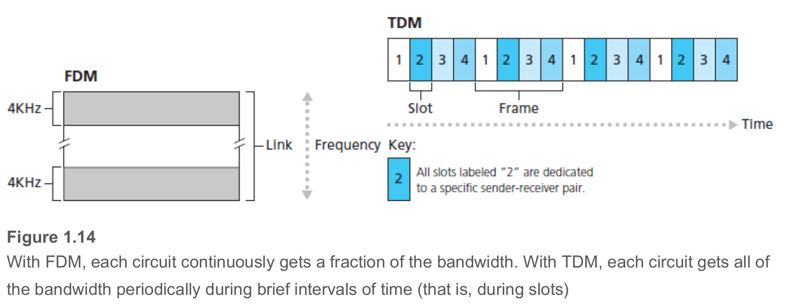
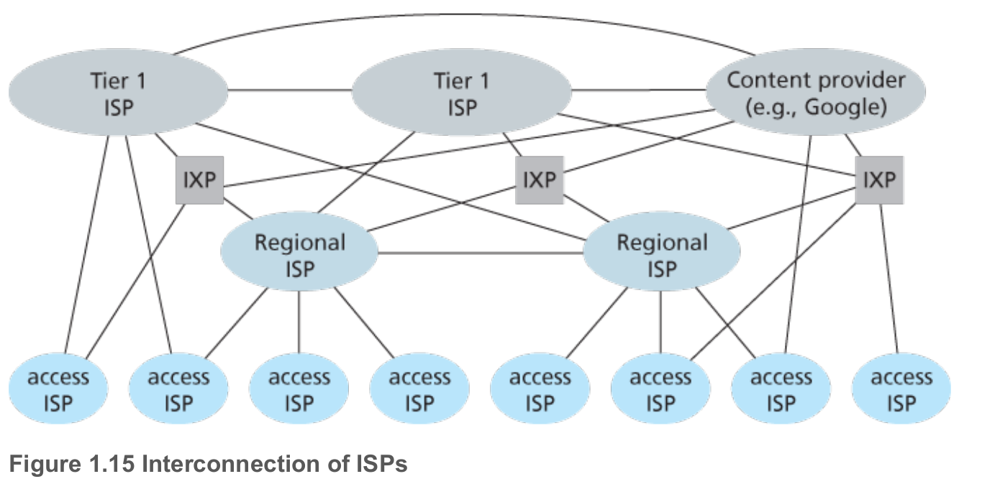

# The Network Core

## Packet Switching

In a network application, end systems exchange **messages** with each other.

- To send a message from a source end system to a destination end system, the source breaks long messages into smaller chunks of data known as **packets**
- Between source and destination, each packet travels through communication links and **packet switches**
  - for which there are two predominant types, **routers** and **link-layer switches**
- Packets are transmitted over each communication link at a rate equal to the full transmission rate of the link

### Store-and-Forward Transmission

Store-and-forward transmission means that the packet switch must receive the entire packet before it can begin to transmit the first bit of the packet onto the outbound link.

- **calculate the amount of time that elapses from when the source begins to send the packet until the destination has received the entire packet**: At time L/R seconds, since the router has just received the entire packet, it can begin to transmit the packet onto the outbound link towards the destination; at time 2L/R, the router has transmitted the entire packet, and the entire packet has been received by the destination. Thus, the total delay is 2L/R. If the switch instead forwarded bits as soon as they arrive (without first receiving the entire packet), then the total delay would be L/R since bits are not held up at the router.
- **calculate the amount of time that elapses from when the source begins to send the first packet until the destination has received all three packets.**: As before, at time L/R, the router begins to forward the first packet. But also at time L/R the source will begin to send the second packet, since it has just finished sending the entire first packet. Thus, at time 2L/R, the destination has received the first packet and the router has received the second packet. Similarly, at time 3L/R, the destination has received the first two packets and the router has received the third packet. Finally, at time 4L/R the destination has received all three packets!

### Queuing Delays and Packet Loss

If an arriving packet needs to be transmitted onto a link but finds the link busy with the transmission of another packet, the arriving packet must wait in the output buffer. Thus, in addition to the store-and-forward delays, packets suffer output buffer **queuing delays**.

Since the amount of buffer space is finite, an arriving packet may find that the buffer is completely full with other packets waiting for transmission. In this case, **packet loss** will occur—either the arriving packet or one of the already-queued packets will be dropped.

## Forwarding Tables and Routing Protocols

When a source end system wants to send a packet to a destination end system, the source includes the destination’s IP address in the packet’s header. As with postal addresses, this address has a hierarchical structure. When a packet arrives at a router in the network, the router examines a portion of the packet’s destination address and forwards the packet to an adjacent router. More specifically, each router has a **forwarding table** that maps destination addresses (or portions of the destination addresses) to that router’s outbound links.

Note now that the Internet has a number of special **routing protocols** that are used to automatically set the forwarding tables. A routing protocol may, for example, determine the shortest path from each router to each destination and use the shortest path results to configure the forwarding tables in the routers.

## Circuit Switching

There are two fundamental approaches to moving data through a network of links and switches: **circuit switching** and **packet switching**.

- **circuit-switched networks**: the resources needed along a path (buffers, link transmission rate) to provide for communication between the end systems are reserved for the duration of the communication session between the end systems.
  - When two hosts want to communicate, the network establishes a dedicated **end-to-end connection** between the two hosts.
- **packet-switched networks**: these resources _are_ not reserved; a session’s messages use the resources on demand and, as a consequence, may have to wait (that is, queue) for access to a communication link.
  - If one of the links is congested because other packets need to be transmitted over the link at the same time, then the packet will have to wait in a buffer at the sending side of the transmission link and suffer a delay.

> As a simple analogy, consider two restaurants, one that requires reservations and another that neither requires reservations nor accepts them. For the restaurant that requires reservations, we have to go through the hassle of calling before we leave home. But when we arrive at the restaurant we can, in principle, immediately be seated and order our meal. For the restaurant that does not require reservations, we don’t need to bother to reserve a table. But when we arrive at the restaurant, we may have to wait for a table before we can be seated.

### Multiplexing in Circuit-Switched Networks

A circuit in a link is implemented with either **frequency-division multiplexing (FDM)** or **time-division multiplexing (TDM)**.

- FDM: the frequency spectrum of a link is divided up among the connections established across the link
  - the link dedicates a frequency band to each connection for the duration of the connection
  - The width of the band is called, not surprisingly, the **bandwidth**
- TDM: time is divided into frames of fixed duration, and each frame is divided into a fixed number of time slots
  - When the network establishes a connection across a link, the network dedicates one time slot in every frame to this connection. These slots are dedicated for the sole use of that connection, with one time slot available for use (in every frame) to transmit the connection’s data.

**Figure 1.14** illustrates FDM and TDM for a specific network link supporting up to four circuits.

- For FDM, the frequency domain is segmented into four bands, each of bandwidth 4 kHz.
- For TDM, the time domain is segmented into frames, with four time slots in each frame; each circuit is assigned the same dedicated slot in the revolving TDM frames.
  - For TDM, the transmission rate of a circuit is equal to the frame rate multiplied by the number of bits in a slot.
    - For example, if the link transmits 8,000 frames per second and each slot consists of 8 bits, then the transmission rate of each circuit is 64 kbps.

Proponents of packet switching have always argued that circuit switching is wasteful because the dedicated circuits are idle during **silent periods**. For example, when one person in a telephone call stops talking, the idle network resources cannot be used by other ongoing connections.

Proponents of packet switching also enjoy pointing out that establishing end-to-end circuits and reserving end-to-end transmission capacity is complicated and requires complex signaling software to coordinate the operation of the switches along the end-to-end path.

### Packet Switching Versus Circuit Switching

- Critics of packet switching have often argued that packet switching is not suitable for real-time services (for example, telephone calls and video conference calls) because of its variable and unpredictable end-to-end delays (due primarily to variable and unpredictable queuing delays).
- Proponents of packet switching argue that:
  - it offers better sharing of transmission capacity than circuit switching and,
  - it is simpler, more efficient, and less costly to implement than circuit switching.

> **Why is packet switching more efficient?** Suppose there are 10 users and that one user suddenly generates one thousand 1,000-bit packets, while other users remain quiescent and do not generate packets. Under TDM circuit switching with 10 slots per frame and each slot consisting of 1,000 bits, the active user can only use its one time slot per frame to transmit data, while the remaining nine time slots in each frame remain idle. It will be 10 seconds before all of the active user’s one million bits of data hasbeen transmitted. In the case of packet switching, the active user can continuously send its packets at the full link rate of 1 Mbps, since there are no other users generating packets that need to be multiplexed with the active user’s packets. In this case, all of the active user’s data will be transmitted within 1 second.

The crucial difference between the two forms of sharing a link’s transmission rate among multiple data streams:

- Circuit switching pre-allocates use of the transmission link regardless of demand, with allocated but unneeded link time going unused.
- Packet switching on the other hand allocates link use _on demand_.

## A Network of Networks

ISPs themselves must be interconnected. This is done by creating a _network of networks_—understanding this phrase is the key to understanding the Internet.

In order to understand today’s Internet network structure, let’s incrementally build a series of network structures, with each new structure being a better approximation of the complex Internet that we have today.

- **Network Structure 1**: interconnects all of the access ISPs with a _single global transit ISP_
  - Such a mesh design is, of course, much too costly for the access ISPs, as it would require each access ISP to have a separate communication link to each of the hundreds of thousands of other access ISPs all over the world.
- **Network Structure 2**: hundreds of thousands of access ISPs and multiple global ­transit ISPs
  - a two-tier hierarchy with global transit providers residing at the top tier and access ISPs at the bottom tier
- **Network Structure 3**: in any given region, there may be a regional ISP to which the access ISPs in the region connect. Each regional ISP then connects to tier-1 ISPs. Tier-1 ISPs are similar to our (imaginary) global transit ISP; but tier-1 ISPs, which actually do exist, do not have a presence in every city in the world.
- **Network Structure 4**: To build a network that more closely resembles today’s Internet, we must add points of presence (PoPs), multi-homing, peering, and Internet exchange points (IXPs) to the hierarchical Network Structure 3.
  - **points of presence (PoP)**: simply a group of one or more routers (at the same location) in the provider’s network where customer ISPs can connect into the provider ISP
    - exist in all levels of the hierarchy, except for the bottom (access ISP) level
  - **multi-homing**: connect to two or more provider ISPs
    - an access ISP may multi-home with two regional ISPs or it may multi-home with two regional ISPs and also with a tier-1 ISP. Similarly, a regional ISP may multi-home with multiple tier-1 ISPs
    - When an ISP multi-homes, it can continue to send and receive packets into the Internet even if one of its providers has a failure
  - **peering**: directly connect their networks together so that all the traffic between them passes over the direct connection rather than through upstream intermediaries
  - **Internet exchange points (IXPs)**: a meeting point where multiple ISPs can peer together
- **Network Structure 5**: builds on top of Network Structure 4 by adding **content-provider networks**
  - Google is currently one of the leading examples of such a content-provider network
  - Importantly, the Google private network only carries traffic to/from Google servers
    - Google private network attempts to “bypass” the upper tiers of the Internet by peering (settlement free) with lower-tier ISPs, either by directly connecting with them or by connecting with them at IXPs

