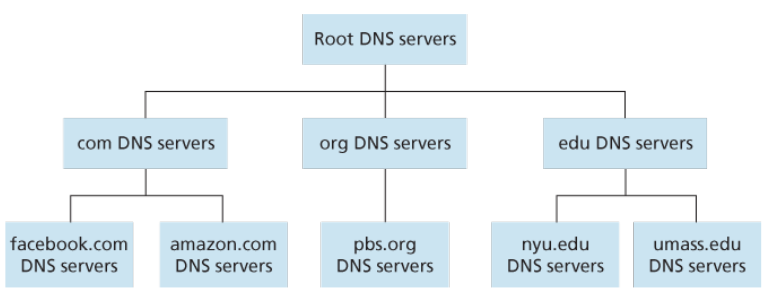

# Chapter 2 Application Layer

- [2.1 Principles of Network Applications](#21-principles-of-network-applications)
- [2.2 The Web and HTTP](#22-the-web-and-http)
- [2.3 Electronic Mail in the Internet](#23-electronic-mail-in-the-internet)
- [2.4 DNS—The Internet’s Directory Service](#24-dnsthe-internets-directory-service)
- [2.6 Video Streaming and Content Distribution Networks](#26-Video-Streaming-and-Content-Distribution-Networks)
- [2.7 Socket Programming: Creating Network Applications](#27-socket-programming-creating-network-applications)


Network applications are the raisons d’être of a computer network—if we couldn’t conceive of any useful
applications, there wouldn’t be any need for networking infrastructure and protocols to support them.
Since the Internet’s inception, numerous useful and entertaining applications have indeed been created.
These applications have been the driving force behind the Internet’s success, motivating people in
homes, schools, governments, and businesses to make the Internet an integral part of their daily
activities.

## 2.1 Principles of Network Applications

- The **application architecture**, on the other hand, is designed by the application developer and dictates how the application is structured over the various end systems. In choosing the application architecture, an application developer will likely draw on one of the two predominant architectural paradigms used in modern network applications: the client-server architecture or the peer-to-peer (P2P) architecture.
In a **client-server architecture**, there is an always-on host, called the server, which services requests from many other hosts, called clients.
In a **P2P architecture**, there is minimal (or no) reliance on dedicated servers in data centers. Instead the application exploits direct communication between pairs of intermittently connected hosts, called peers.
  - One of the most compelling features of P2P architectures is their **self-scalability**. For example, in a P2P file-sharing application, although each peer generates workload by requesting files, each peer also adds service capacity to the system by distributing files to other peers. P2P architectures are also cost effective, since they normally don’t require significant server infrastructure and server bandwidth (in contrast with clients-server designs with datacenters). However, P2P applications face challenges of security, performance, and reliability due to their highly decentralized structure.

### Transport Services Available to Applications

#### Reliable Data Transfer

Something has to be done to guarantee that the data sent by one end of the application is delivered correctly and completely to the other end of the application. If a protocol provides such a guaranteed data delivery service, it is said to provide **reliable data transfer**.

When a transport-layer protocol doesn’t provide reliable data transfer, some of the data sent by thesending process may never arrive at the receiving process. This may be acceptable for **loss-tolerant applications**, most notably multimedia applications such as conversational audio/video that can tolerate some amount of data loss.

#### Throughput

Applications that have throughput requirements are said to be **bandwidth-sensitive applications**. Many current multimedia applications are bandwidth sensitive, although some multimedia applications may use adaptive coding techniques to encode digitized voice or video at a rate that matches the currently available throughput.

While bandwidth-sensitive applications have specific throughput requirements, **elastic applications** can make use of as much, or as little, throughput as happens to be available. Electronic mail, file transfer, and Web transfers are all elastic applications. Of course, the more throughput, the better. There’san adage that says that one cannot be too rich, too thin, or have too much throughput!

#### Timing

A transport-layer protocol can also provide timing guarantees. As with throughput guarantees, timing guarantees can come in many shapes and forms. An example guarantee might be that every bit that the sender pumps into the socket arrives at the receiver’s socket no more than 100 msec later.

For non-real-time applications, lower delay is always preferable to higher delay, but no tight constraint is placed on the end-to-end delays.

#### Security

Finally, a transport protocol can provide an application with one or more security services. For example,
in the sending host, a transport protocol can encrypt all data transmitted by the sending process, and in
the receiving host, the transport-layer protocol can decrypt the data before delivering the data to the
receiving process. Such a service would provide confidentiality between the two processes, even if the
data is somehow observed between sending and receiving processes. A transport protocol can also
provide other security services in addition to confidentiality, including data integrity and end-point
authentication.

### Transport Services Provided by the Internet

The Internet (and, more generally, TCP/IP networks) makes two transport protocols available to
applications, UDP and TCP. When you (as an application developer) create a new network application
for the Internet, one of the first decisions you have to make is whether to use UDP or TCP. Each of
these protocols offers a different set of services to the invoking applications.

#### TCP Services

The TCP service model includes a connection-oriented service and a reliable data transfer service.
When an application invokes TCP as its transport protocol, the application receives both of these
services from TCP.

- **Connection-oriented service**. TCP has the client and server exchange transport-layer control information with each other before the application-level messages begin to flow. This so-called handshaking procedure alerts the client and server, allowing them to prepare for an onslaught of packets. After the handshaking phase, a **TCP connection** is said to exist between the sockets of the two processes. The connection is a full-duplex connection in that the two processes can send messages to each other over the connection at the same time. When the application finishes sending messages, it must tear down the connection.
- **Reliable data transfer service**. The communicating processes can rely on TCP to deliver all data
sent without error and in the proper order. When one side of the application passes a stream of
bytes into a socket, it can count on TCP to deliver the same stream of bytes to the receiving socket,
with no missing or duplicate bytes.

TCP also includes a congestion-control mechanism, a service for the general welfare of the Internet
rather than for the direct benefit of the communicating processes. The TCP congestion-control
mechanism throttles a sending process (client or server) when the network is congested between
sender and receiver.

> Neither TCP nor UDP provides any encryption—the data that the sending process passes into its socket is the same data that travels over the network to the destination process. Because privacy and other security issues have become critical for many applications, the Internet community has developed an enhancement for TCP, called **Secure Sockets Layer (SSL)**.

#### UDP Services

UDP is a no-frills, lightweight transport protocol, providing minimal services. UDP is connectionless, so
there is no handshaking before the two processes start to communicate. UDP provides an unreliable
data transfer service—that is, when a process sends a message into a UDP socket, UDP provides no
guarantee that the message will ever reach the receiving process. Furthermore, messages that do arrive
at the receiving process may arrive out of order.

UDP does not include a congestion-control mechanism, so the sending side of UDP can pump data into
the layer below (the network layer) at any rate it pleases. (Note, however, that the actual end-to-end
throughput may be less than this rate due to the limited transmission capacity of intervening links or due
to congestion).

## 2.2 The Web and HTTP

HTTP uses TCP as its underlying transport protocol (rather than running on top of UDP).

It is important to note that the server sends requested files to clients without storing any state
information about the client. If a particular client asks for the same object twice in a period of a few
seconds, the server does not respond by saying that it just served the object to the client; instead, the
server resends the object, as it has completely forgotten what it did earlier. Because an HTTP server
maintains no information about the clients, HTTP is said to be a **stateless protocol**.

### Non-Persistent and Persistent Connections

- **non-persistent connections**: each request/response sent over a *separate* TCP connection
  - Non-persistent connections have some shortcomings
    - a brand-new connection must be established and maintained for *each requested object*
    - each object suffers a delivery delay of two RTTs—one RTT to establish the TCP connection and one RTT to request and receive an object
- **persistent connections**: all of the requests and their corresponding responses be sent over the *same* TCP connection

With HTTP 1.1 persistent connections, the server leaves the TCP connection open after sending a
response. Subsequent requests and responses between the same client and server can be sent over
the same connection. In particular, an entire Web page (in the example above, the base HTML file and
the 10 images) can be sent over a single persistent TCP connection.

### HTTP Message Format

The HTTP specifications [RFC 1945; RFC 2616; RFC 7540] include the definitions of the HTTP
message formats. There are two types of HTTP messages, request messages and response messages,
both of which are discussed below.

#### HTTP Request Message

    GET /somedir/page.html HTTP/1.1
    Host: www.someschool.edu
    Connection: close
    User-agent: Mozilla/5.0
    Accept-language: fr

The first line of an HTTP request message is called the **request line**; the subsequent lines are called the **header lines**.

#### HTTP Response Message

    HTTP/1.1 200 OK
    Connection: close
    Date: Tue, 18 Aug 2015 15:44:04 GMT
    Server: Apache/2.2.3 (CentOS)
    Last-Modified: Tue, 18 Aug 2015 15:11:03 GMT
    Content-Length: 6821
    Content-Type: text/html

    (data data data data data ...)

## 2.3 Electronic Mail in the Internet

- all mail messages to simple 7-bit ASCII
- First, the client SMTP (running on the sending mail server host) has TCP establish a connection to port 25 at the server SMTP (running on the receiving mail server host)

### POP3

Post Office Protocol—Version 3 (POP3)

POP3 is an extremely simple mail access protocol. It is defined in [RFC 1939], which is short and quite
readable. Because the protocol is so simple, its functionality is rather limited. POP3 begins when the
user agent (the client) opens a TCP connection to the mail server (the server) on port 110. With the TCPconnection established, POP3 progresses through three phases: authorization, transaction, and update.

- **authorization**: the user agent sends a username and a password (in the clear) to authenticate the user.
- **transaction**: the user agent retrieves messages; also during this phase, the user agent can mark messages for deletion, remove deletion marks, and obtain mail statistics.
- **update**: occurs after the client has issued the `quit` command, ending the POP3 session; at this time, the mail server deletes the messages that were marked for deletion.

### IMAP

POP3 protocol does not provide any means for a user to create remote folders and assign messages to folders.

An IMAP server will associate each message with a folder; when a message first arrives at the server, it
is associated with the recipient’s INBOX folder. The recipient can then move the message into a new,
user-created folder, read the message, delete the message, and so on.

Another important feature of IMAP is that it has commands that permit a user agent to obtain
components of messages. For example, a user agent can obtain just the message header of a message
or just one part of a multipart MIME message. This feature is useful when there is a low-bandwidth
connection (for example, a slow-speed modem link) between the user agent and its mail server.

## 2.4 DNS—The Internet’s Directory Service

- All DNS query and reply messages are sent within UDP datagrams to port 53.

The DNS is:

1. a distributed database implemented in a hierarchy of DNS servers
2. an application-layer protocol that allows hosts to query the distributed database

There are three classes of DNS servers

- root DNS servers
- top-level domain (TLD) DNSservers
- authoritative DNS servers



### DNS Records and Messages

The DNS servers that together implement the DNS distributed database store resource records (RRs),
including RRs that provide hostname-to-IP address mappings. Each DNS reply message carries one or
more resource records.

A resource record is a four-tuple that contains the following fields:

    (Name, Value, Type, TTL)

- If `Type=A`, then `Name` is a hostname and `Value` is the IP address for the hostname. Thus, a Type `A` record provides the standard hostname-to-IP address mapping.
- If T`ype=NS`, then `Name` is a domain (such as foo.com) and `Value` is the hostname of an authoritative DNS server that knows how to obtain the IP addresses for hosts in the domain.
  - This record is used to route DNS queries further along in the query chain.
- If `Type=CNAME`, then `Value` is a canonical hostname for the alias hostname `Name`. This record can provide querying hosts the canonical name for a hostname.
- If `Type=MX`, then `Value` is the canonical name of a mail server that has an alias hostname `Name`.
- `TTL` is the time to live of the resource record; it determines when a resource should be removed from a cache.

### Summary

Suppose Alice in Australia wants to view the Web page www.networkutopia.com. As discussed earlier, her host will first send
a DNS query to her local DNS server. The local DNS server will then contact a TLD com server. (The
local DNS server will also have to contact a root DNS server if the address of a TLD com server is not
cached.) This TLD server contains the Type NS and Type A resource records listed above, because the
registrar had these resource records inserted into all of the TLD com servers. The TLD com server
sends a reply to Alice’s local DNS server, with the reply containing the two resource records. The local
DNS server then sends a DNS query to 212.212.212.1 , asking for the Type A record corresponding
to www.networkutopia.com. This record provides the IP address of the desired Web server, say,
212.212.71.4 , which the local DNS server passes back to Alice’s host. Alice’s browser can nowinitiate a TCP connection to the host 212.212.71.4 and send an HTTP request over the connection.

## 2.6 Video Streaming and Content Distribution Networks

Streaming prerecorded video now accounts for the majority of the traffic in residential ISPs in North
America. In particular, the Netflix and YouTube services alone consumed a whopping 37% and 16%,
respectively, of residential ISP traffic in 2015

### Internet Video

- Compressed Internet video typically ranges from 100 kbps for low-quality video to over 3 Mbps for streaming high-definition movies; 4K streaming envisions a bitrate of more than 10 Mbps.
- In order to provide continuous playout, the network must provide an average throughput to the streaming application that is at least as large as the bit rate of the compressed video.

### HTTP Streaming and DASH

In HTTP streaming, the video is simply stored at an HTTP server as an ordinary file with a specific URL.
When a user wants to see the video, the client establishes a TCP connection with the server and issues
an HTTP GET request for that URL. The server then sends the video file, within an HTTP response
message, as quickly as the underlying network protocols and traffic conditions will allow. On the client
side, the bytes are collected in a client application buffer. Once the number of bytes in this buffer
exceeds a predetermined threshold, the client application begins playback

**Dynamic Adaptive Streaming over HTTP (DASH)** - the video is encoded into several different versions, with each version having a
different bit rate and, correspondingly, a different quality level. The client dynamically requests chunks of
video segments of a few seconds in length. When the amount of available bandwidth is high, the client
naturally selects chunks from a high-rate version; and when the available bandwidth is low, it naturally
selects from a low-rate version. The client selects different chunks one at a time with HTTP GET request messages

With DASH, each video version is stored in the HTTP server, each with a different URL. The HTTPserver also has a **manifest file**, which provides a URL for each version along with its bit rate.

## 2.7 Socket Programming: Creating Network Applications

UDPClient.py

```python
from socket import *

serverName = ’hostname’
serverPort = 12000clientSocket = socket(AF_INET, SOCK_DGRAM)
message = raw_input(’Input lowercase sentence:’)
clientSocket.sendto(message.encode(),(serverName, serverPort))
modifiedMessage, serverAddress = clientSocket.recvfrom(2048)
print(modifiedMessage.decode())
clientSocket.close()
```

- `clientSocket = socket(AF_INET, SOCK_DGRAM)`
  - `AF_INET` indicates that the underlying network is using IPv4
  - The second parameter indicates that the socket is of type `SOCK_DGRAM`, which means it is a UDP socket (rather than a TCP socket)

UDPServer.py

```python
from socket import *
serverPort = 12000
serverSocket = socket(AF_INET, SOCK_DGRAM)
serverSocket.bind((’’, serverPort))
print(”The server is ready to receive”)
while True:
  message, clientAddress = serverSocket.recvfrom(2048)
  modifiedMessage = message.decode().upper()
  serverSocket.sendto(modifiedMessage.encode(), clientAddress)
```
