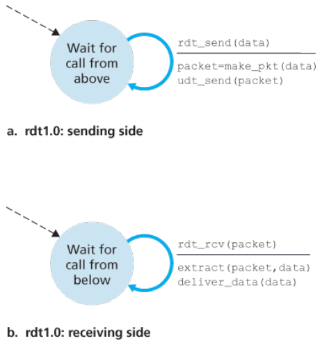
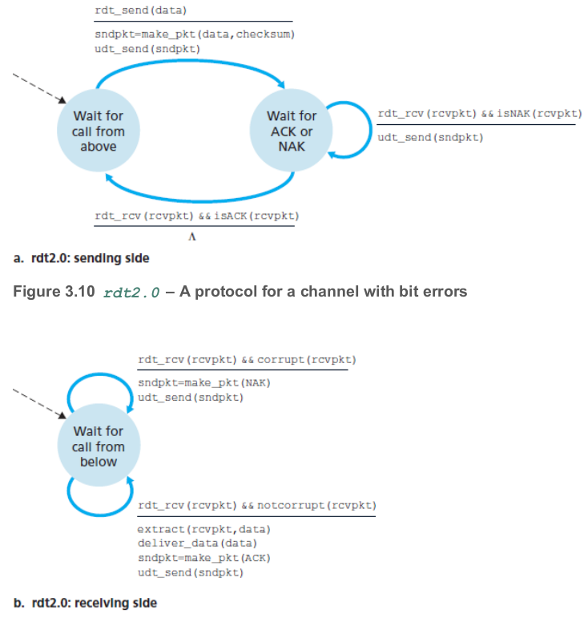
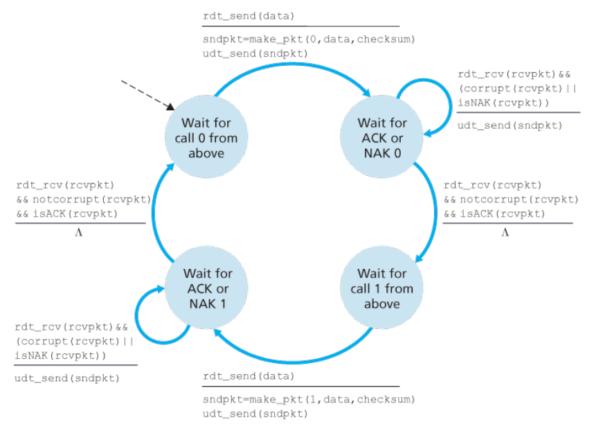
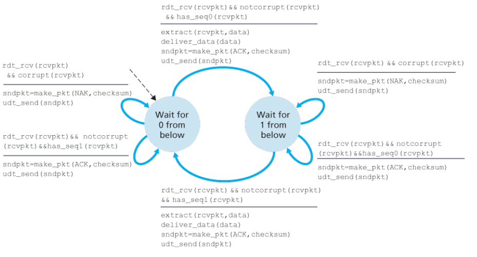
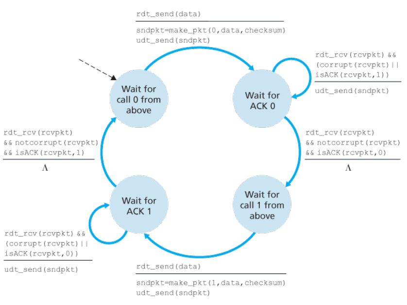
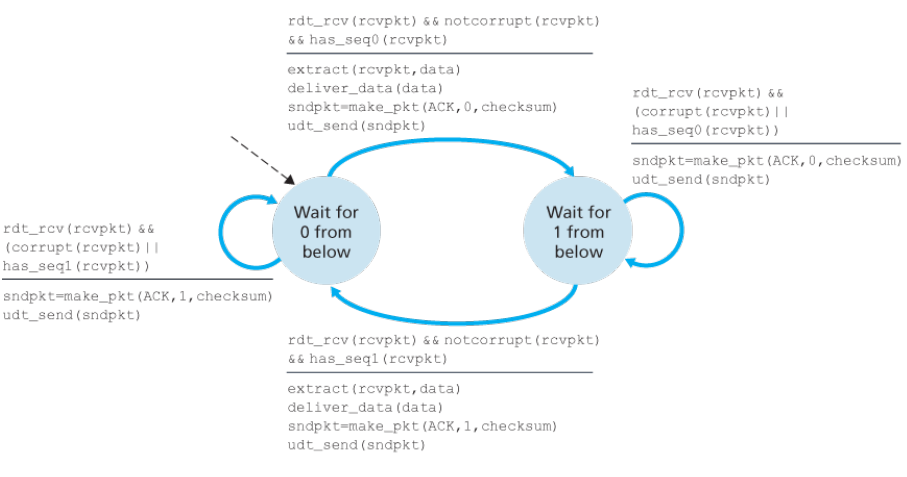
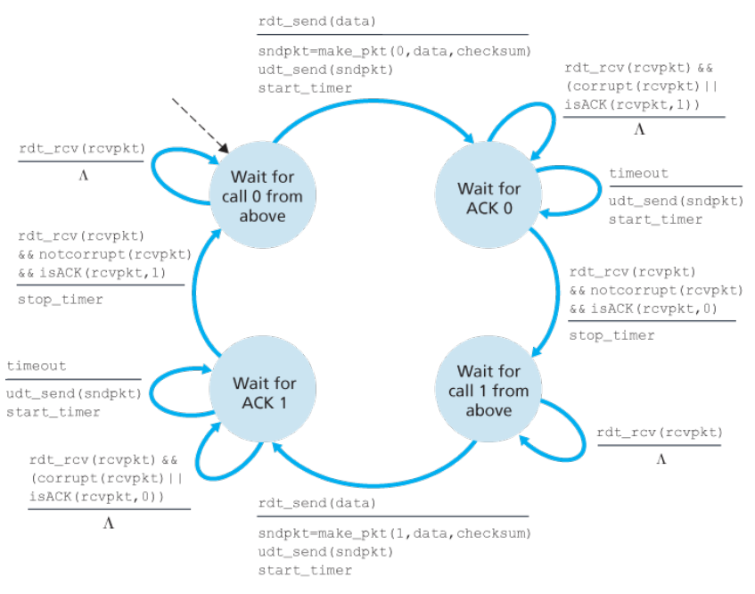
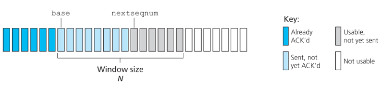
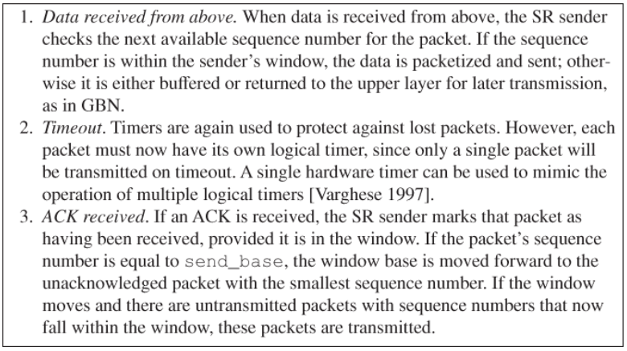
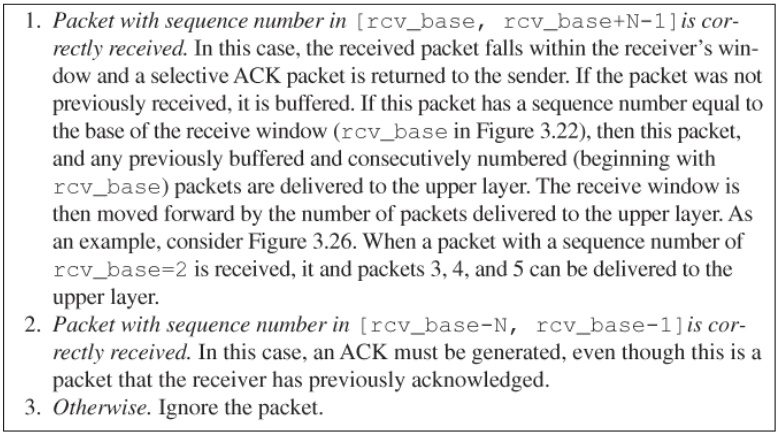

# Chapter 3 Transport Layer

- [3.1 Introduction and Transport-Layer Services](#31-Introduction-and-Transport-Layer-Services)
- [3.2 Multiplexing and Demultiplexing](#32-Multiplexing-and-Demultiplexing)
- [3.3 Connectionless Transport: UDP](#33-Connectionless-Transport-UDP)
- [3.4 Principles of Reliable Data Transfer](#34-Principles-of-Reliable-Data-Transfer)
- [3.5 Connection-Oriented Transport: TCP](#35-Connection-Oriented-Transport-TCP)

## 3.1 Introduction and Transport-Layer Services

A transport-layer protocol provides for logical communication between application processes running
on different hosts. By logical communication, we mean that from an application’s perspective, it is as if
the hosts running the processes were directly connected; in reality, the hosts may be on opposite sides
of the planet, connected via numerous routers and a wide range of link types.

### Relationship Between Transport and Network Layers

Recall that the transport layer lies just above the network layer in the protocol stack. Whereas a
transport-layer protocol provides logical communication between processes running on different hosts, a network-layer protocol provides logical-communication between
hosts.

## 3.2 Multiplexing and Demultiplexing

- **Demultiplexing**: Each transport-layer segment has a set of fields in the segment for this purpose. At the receiving end, the transport layer examines these fields to identify the receiving socket and then directs the segment to that socket. This job of delivering the data in a transport-layer segment to the correct socket.
- The job of gathering data chunks at the source host from different sockets, encapsulating each data chunk with header information (that will later be used in demultiplexing) to create segments, and passing the segments to the network layer is called **multiplexing**.

Each port number is a 16-bit number, ranging from 0 to 65535. The port numbers ranging from 0 to 1023 are called well-known port numbers and are restricted.

## 3.3 Connectionless Transport: UDP

UDP takes messages from the application process, attaches source and destination port number
fields for the multiplexing/demultiplexing service, adds two other small fields, and passes the resulting
segment to the network layer. The network layer encapsulates the transport-layer segment into an IP
datagram and then makes a best-effort attempt to deliver the segment to the receiving host. If the
segment arrives at the receiving host, UDP uses the destination port number to deliver the segment’s
data to the correct application process. Note that with UDP there is no handshaking between sending
and receiving transport-layer entities before sending a segment. For this reason, UDP is said to be
connectionless.

DNS is an example of an application-layer protocol that typically uses UDP.

The TCP segment has 20 bytes of header overhead in every segment, whereas UDP has only 8 bytes of overhead.

Some applications are better suited for UDP for the following reasons:

- **Finer application-level control over what data is sent, and when**: Under UDP, as soon as an application process passes data to UDP, UDP will package the data inside a UDP segment and immediately pass the segment to the network layer.
- **No connection establishment**: TCP uses a three-way handshake before it starts to transfer data. UDP just blasts away without any formal preliminaries. Thus UDP does not introduce any delay to establish a connection.
- **No connection state**: TCP maintains connection state in the end systems. This connection state includes receive and send buffers, congestion-control parameters, and sequence and acknowledgment number parameters. We will see in Section 3.5 that this state information is needed to implement TCP’s reliable data transfer service and to provide congestion control. UDP, on the other hand, does not maintain connection state and does not track any of these parameters. For this reason, a server devoted to a particular application can typically support many more active clients when the application runs over UDP rather than TCP.
- **Small packet header overhead**: The TCP segment has 20 bytes of header overhead in every segment, whereas UDP has only 8 bytes of overhead.

### UDP Segment Structure

- The application data occupies the data field of the UDP segment.
- The UDP header has only four fields, each consisting of two bytes.
- the port numbers allow the destination host to pass the application data to the correct process running on the destination end system
- The length field specifies the number of bytes in the UDP segment (header plus data)
  - An explicit length value is needed since the size of the data field may differ from one UDP segment to the next.
- The checksum is used by the receiving host to check whether errors have been introduced into the segment.

### UDP Checksum

The UDP checksum provides for error detection. That is, the checksum is used to determine whether
bits within the UDP segment have been altered (for example, by noise in the links or while stored in a
router) as it moved from source to destination.

UDP at the sender side performs the 1s complement of the sum of all the 16-bit words in the segment,
with any overflow encountered during the sum being wrapped around. This result is put in the checksum
field of the UDP segment.

## 3.4 Principles of Reliable Data Transfer

### Building a Reliable Data Transfer Protocol

#### rdt1.0 - Reliable Data Transfer over a Perfectly Reliable Channel

The sending side of `rdt` simply accepts data from the upper layer via the `rdt_send(data)` event,
creates a packet containing the data (via the action m`ake_pkt(data)` ) and sends the packet into the
channel. In practice, the `rdt_send(data)` event would result from a procedure call (for example, to
`rdt_send()`) by the upper-layer application.

On the receiving side, `rdt` receives a packet from the underlying channel via the `rdt_rcv(packet)`
event, removes the data from the packet (via the action `extract (packet, data)` ) and passes the
data up to the upper layer (via the action `deliver_data(data)` ). In practice, the
`rdt_rcv(packet)` event would result from a procedure call (for example, to `rdt_rcv()` ) from the
lower-layer protocol.

#### rdt2.0 - Reliable Data Transfer over a Channel with Bit Errors

A more realistic model of the underlying channel is one in which bits in a packet may be corrupted.

This message-dictation protocol uses both **positive acknowledgments** (“OK”) and **negative acknowledgments** (“Please repeat that.”).

In a computer network setting, reliable data transfer protocols based on such retransmission are known as **ARQ (Automatic Repeat reQuest) protocols**.

Fundamentally, three additional protocol capabilities are required in ARQ protocols to handle the presence of bit errors:

- **Error detection**. First, a mechanism is needed to allow the receiver to detect when bit errors have occurred.
- **Receiver feedback**. Since the sender and receiver are typically executing on different end systems, possibly separated by thousands of miles, the only way for the sender to learn of the receiver’s view of the world (in this case, whether or not a packet was received correctly) is for the receiver to provide explicit feedback to the sender.
- **Retransmission**. A packet that is received in error at the receiver will be retransmitted by the sender.

The sender will not send a new piece of data until it is sure that the receiver has correctly received the current packet. Because of this behavior, protocols such as rdt2.0 are known as **stop-and-wait** protocols.

Flaws of `rdt2.0` - the possibility that the ACK or NAK packet could be corrupted!

A simple solution to this new problem (and one adopted in almost all existing data transfer protocols,
including TCP) is to add a new field to the data packet and have the sender number its data packets by
putting a **sequence number** into this field.

The `rdt2.1` sender and receiver FSMs each now have twice as many states as before. This is because the
protocol state must now reflect whether the packet currently being sent (by the sender) or expected (at
the receiver) should have a sequence number of 0 or 1.

Protocol rdt2.1 uses both positive and negative acknowledgments from the receiver to the sender.
When an out-of-order packet is received, the receiver sends a positive acknowledgment for the packet it
has received. When a corrupted packet is received, the receiver sends a negative acknowledgment.

**rdt2.1 sender**:

**rdt2.1 reciever**:

A sender that receives two ACKs for the same packet (that is, receives **duplicate ACKs**) knows that the receiver did not correctly receive the packet following the packet that is being ACKed twice.

Our NAK-free reliable data transfer protocol for a channel with bit errors is `rdt2.2`. One subtle change between `rtdt2.1` and `rdt2.2` is that the receiver must now include the sequence
number of the packet being acknowledged by an ACK message (this is done by including the `ACK , 0`
or `ACK, 1` argument in `make_pkt()` in the receiver FSM), and the sender must now check the
sequence number of the packet being acknowledged by a received ACK message (this is done by
including the `0` or `1` argument in `isACK()` in the sender FSM).

#### rdt3.0 - Reliable Data Transfer over a Lossy Channel with Bit Errors

Suppose now that in addition to corrupting bits, the underlying channel can lose packets

**rdt2.2 sender**:

The use of checksumming, sequence numbers, ACK packets, and retransmissions—the techniques already developed in rdt2.2 —will allow us to answer the latter concern.

**rdt2.2 reciever**:

The approach thus adopted in practice is for the sender to judiciously choose a time value
such that packet loss is likely, although not guaranteed, to have happened. If an ACK is not received
within this time, the packet is retransmitted. Note that if a packet experiences a particularly large delay,
the sender may retransmit the packet even though neither the data packet nor its ACK have been lost.
This introduces the possibility of **duplicate data packets** in the sender-to-receiver channel. Happily,
protocol `rdt2.2` already has enough functionality (that is, sequence numbers) to handle the case of
duplicate packets.

Implementing a time-based retransmission mechanism requires a
**countdown timer** that can interrupt the sender after a given amount of time has expired. The sender
will thus need to be able to (1) start the timer each time a packet (either a first-time packet or a
retransmission) is sent, (2) respond to a timer interrupt (taking appropriate actions), and (3) stop the
timer.

**rdt3.0 sender**:

Because packet sequence numbers alternate between 0 and 1, protocol rdt3.0 is sometimes known as the **alternating-bit protocol**.

We have now assembled the key elements of a data transfer protocol. Checksums, sequence numbers,
timers, and positive and negative acknowledgment packets each play a crucial and necessary role in the
operation of the protocol.

### Pipelined Reliable Data Transfer Protocols

Protocol rdt3.0 is a functionally correct protocol, but it is unlikely that anyone would be happy with its
performance.

Since the many in-transit sender-to-receiver packets can be visualized as filling a pipeline, this technique is known as **pipelining**.

Pipelining has the following consequences for reliable data transfer protocols:

- The range of sequence numbers must be increased, since each in-transit packet (not counting retransmissions) must have a unique sequence number and there may be multiple, in-transit, unacknowledged packets.
- The sender and receiver sides of the protocols may have to buffer more than one packet. Minimally, the sender will have to buffer packets that have been transmitted but not yet acknowledged. Buffering of correctly received packets may also be needed at the receiver, as discussed below.
- The range of sequence numbers needed and the buffering requirements will depend on the manner in which a data transfer protocol responds to lost, corrupted, and overly delayed packets. Two basic approaches toward pipelined error recovery can be identified: **Go-Back-N** and **selective repeat**.

#### Go-Back-N

In a Go-Back-N (GBN) protocol, the sender is allowed to transmit multiple packets (when available)
without waiting for an acknowledgment, but is constrained to have no more than some maximum
allowable number, N, of unacknowledged packets in the pipeline.

The GBN protocol allows the sender to potentially “fill the pipeline”. scenarios in which GBN itself suffers from performance problems. In particular, when the window size
and bandwidth-delay product are both large, many packets can be in the pipeline. A single packet error
can thus cause GBN to retransmit a large number of packets, many unnecessarily.

#### Selective Repeat (SR)

As the name suggests, selective-repeat protocols avoid unnecessary retransmissions by having the
sender retransmit only those packets that it suspects were received in error (that is, were lost or
corrupted) at the receiver.

**SR sender events and actions**:

**SR receiver events and actions**:

It is important to note that in Step 2 in Figure 3.25, the receiver reacknowledges (rather than ignores)
already received packets with certain sequence numbers below the current window base. You should
convince yourself that this reacknowledgment is indeed needed.

The window size must be less than or equal to half the size of the sequence number space for SR protocols.

### Summary of reliable data transfer mechanisms and their use

| | |
| :-- | :-- |
| Mechanism | Use, Comments |
| Checksum  | Used to detect bit errors in a transmitted packet. Timer Used to timeout/retransmit a packet, possibly because the packet (or its ACK) was lost within the channel. Because timeouts can occur when a packet is delayed but not lost (premature timeout), or when a packet has been received by the receiver but the receiver-to-sender ACK has been lost, duplicate copies of a packet may be received by a receiver. |
| Sequence number | Used for sequential numbering of packets of data flowing from sender to receiver. Gaps in the sequence numbers of received packets allow the receiver to detect a lost packet. Packets with duplicate sequence numbers allow the receiver to detect duplicate copies of a packet. |
| Acknowledgment | Used by the receiver to tell the sender that a packet or set of packets has been received correctly. Acknowledgments will typically carry the sequence number of the packet or packets being acknowledged. Acknowledgments may be individual or cumulative, depending on the protocol. |
| Negative acknowledgment | Used by the receiver to tell the sender that a packet has not been received correctly. Negative acknowledgments will typically carry the sequence number of the packet that was not received correctly. |
| Window, pipelining | The sender may be restricted to sending only packets with sequence numbers that fall within a given range. By allowing multiple packets to be transmitted but not yet acknowledged, sender utilization can be increased over a stop-and-wait mode of operation. We’ll see shortly that the window size may be set on the basis of the receiver’s ability to receive and buffer messages, or the level of congestion in the network, or both. |

## 3.5 Connection-Oriented Transport: TCP

TCP is said to be **connection-oriented** because before one application process can begin to send data
to another, the two processes must first “handshake” with each other—that is, they must send some
preliminary segments to each other to establish the parameters of the ensuing data transfer.

A TCP connection provides a **full-duplex** service: If there is a TCP connection between Process A on
one host and Process B on another host, then application-layer data can flow from Process A to
Process B at the same time as application-layer data flows from Process B to Process A.

A TCP connection is also always **point-to-point**, that is, between a single sender and a single receiver. So- called “multicasting” (see the online supplementary materials for this text)—the transfer of data from one sender to many receivers in a single send operation—is not possible with TCP.

Both Ethernet and PPP link-layer protocols have an MTU of 1,500 bytes. Thus a typical value of MSS is 1460 bytes.
