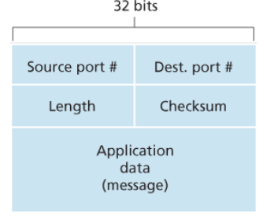

# Chapter 3 Transport Layer

- [3.1 Introduction and Transport-Layer Services](#31-Introduction-and-Transport-Layer-Services)
- [3.2 Multiplexing and Demultiplexing](#32-Multiplexing-and-Demultiplexing)
- [3.3 Connectionless Transport: UDP](#33-Connectionless-Transport-UDP)

## 3.1 Introduction and Transport-Layer Services

A transport-layer protocol provides for logical communication between application processes running
on different hosts. By logical communication, we mean that from an application’s perspective, it is as if
the hosts running the processes were directly connected; in reality, the hosts may be on opposite sides
of the planet, connected via numerous routers and a wide range of link types.

### Relationship Between Transport and Network Layers

Recall that the transport layer lies just above the network layer in the protocol stack. Whereas a
transport-layer protocol provides logical communication between processes running on different hosts, a network-layer protocol provides logical-communication between
hosts.

## 3.2 Multiplexing and Demultiplexing

- **Demultiplexing**: Each transport-layer segment has a set of fields in the segment for this purpose. At the receiving end, the transport layer examines these fields to identify the receiving socket and then directs the segment to that socket. This job of delivering the data in a transport-layer segment to the correct socket.
- The job of gathering data chunks at the source host from different sockets, encapsulating each data chunk with header information (that will later be used in demultiplexing) to create segments, and passing the segments to the network layer is called **multiplexing**.

Each port number is a 16-bit number, ranging from 0 to 65535. The port numbers ranging from 0 to 1023 are called well-known port numbers and are restricted.

## 3.3 Connectionless Transport: UDP

UDP takes messages from the application process, attaches source and destination port number
fields for the multiplexing/demultiplexing service, adds two other small fields, and passes the resulting
segment to the network layer. The network layer encapsulates the transport-layer segment into an IP
datagram and then makes a best-effort attempt to deliver the segment to the receiving host. If the
segment arrives at the receiving host, UDP uses the destination port number to deliver the segment’s
data to the correct application process. Note that with UDP there is no handshaking between sending
and receiving transport-layer entities before sending a segment. For this reason, UDP is said to be
connectionless.

DNS is an example of an application-layer protocol that typically uses UDP.

The TCP segment has 20 bytes of header overhead in every segment, whereas UDP has only 8 bytes of overhead.

Some applications are better suited for UDP for the following reasons:

- **Finer application-level control over what data is sent, and when**: Under UDP, as soon as an application process passes data to UDP, UDP will package the data inside a UDP segment and immediately pass the segment to the network layer.
- **No connection establishment**: TCP uses a three-way handshake before it starts to transfer data. UDP just blasts away without any formal preliminaries. Thus UDP does not introduce any delay to establish a connection.
- **No connection state**: TCP maintains connection state in the end systems. This connection state includes receive and send buffers, congestion-control parameters, and sequence and acknowledgment number parameters. We will see in Section 3.5 that this state information is needed to implement TCP’s reliable data transfer service and to provide congestion control. UDP, on the other hand, does not maintain connection state and does not track any of these parameters. For this reason, a server devoted to a particular application can typically support many more active clients when the application runs over UDP rather than TCP.
- **Small packet header overhead**: The TCP segment has 20 bytes of header overhead in every segment, whereas UDP has only 8 bytes of overhead.

### UDP Segment Structure

- The application data occupies the data field of the UDP segment.
- The UDP header has only four fields, each consisting of two bytes.
- the port numbers allow the destination host to pass the application data to the correct process running on the destination end system
- The length field specifies the number of bytes in the UDP segment (header plus data)
  - An explicit length value is needed since the size of the data field may differ from one UDP segment to the next.
- The checksum is used by the receiving host to check whether errors have been introduced into the segment.

### UDP Checksum

The UDP checksum provides for error detection. That is, the checksum is used to determine whether
bits within the UDP segment have been altered (for example, by noise in the links or while stored in a
router) as it moved from source to destination.

UDP at the sender side performs the 1s complement of the sum of all the 16-bit words in the segment,
with any overflow encountered during the sum being wrapped around. This result is put in the checksum
field of the UDP segment.
