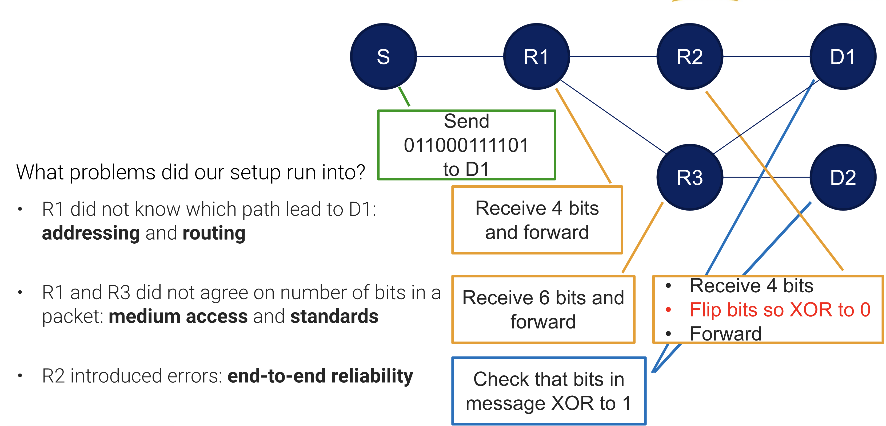
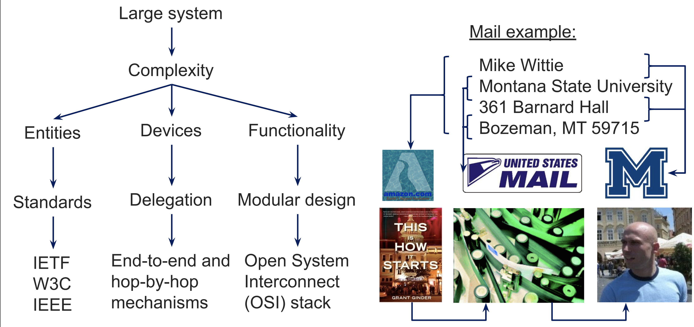
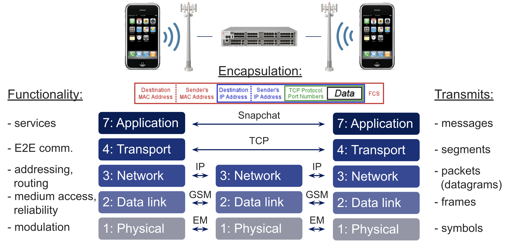
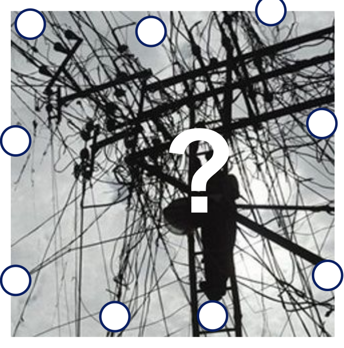
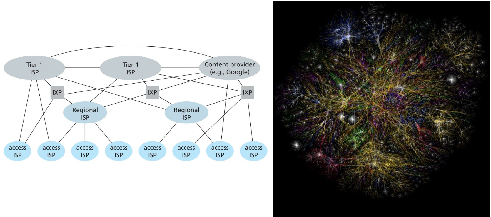

# 8/27 OSI Stack and Internet Topology

Lecture Slides: [OSI stack and Internet Topology.pdf](https://github.com/RK-MSU/CSCI-466-Networks/blob/class-notes/Lecture-Slides/2.%20OSI%20stack%20and%20Internet%20Topology.pdf)

## The Internet

*The Quest for Low Latency*: America's trading centers need information fast.

- Fiber Wire
- Humming Bird Project - Towers in a path to transfer data
- Starlink: constellation of satellites

## Communication Example

## Argument for Layered Architecture

## Internet Protocol Stack

## Growth of the Internet

How to connect Internet Hosts?

- For best end-to-end performance? Direct, everyone connected to everyone
- For lowest cost?
  - Minimum spanning tree
  - Takes along time to setup
  - Nodes that have many many links
- Lower delay: routes
- To allow regional growth?
  - Tree, but not very reliable

## Internet Topology

- IXP: building with lots of routers - link a router of ISPs

## Tier-1 ISP - CentryLink

CenturyLink started as a construction company

- Machines to lay fiber
- Raced the machines
- Most cables buried in the ground are not used
