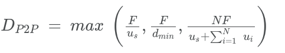
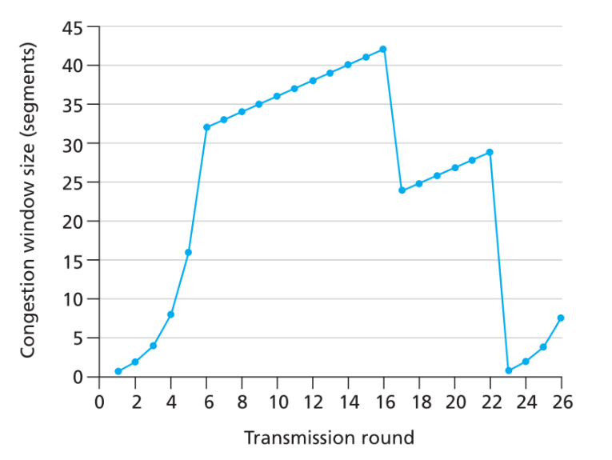

# Homework 2 (Chapters 2,3)

## Question 1 (2 points)

### Discuss the relative advantages and disadvantages of persistent and non-persistent HTTP connections in terms of Web server scalability and Web page download time

The difference between persistent and non-persistent HTTP connections is: non-persistent connections require a individual request/response sent over a separate TCP connection, whereas with persistent connections, all of the requests and their corresponding responses can be sent over the same TCP connection.

This can be a significant factor in Web server scalability/Web page download time. Let's say for example, there exists a specific web page ("home/index.html") located on the server. This web page also includes 3 images (all of which are also hosted on the save server). With a non-persistent connection:

1. The client first initiates a TCP connection to the server
2. Then sends an HTTP request for the initial object ("home/index.html").
3. The server processes the request, retrieves the requested object, encapsulates the object in an HTTP response, and sends the HTTP response back to the client.
4. The TCP connection is closed once the client receives the HTTP response and intact message.
5. These steps are repeated for each of the 3 images included in the HTML object (or web page).

In this example, a total of 4 TCP connections were generated. But now imagine that the webpage has many more images, and there are hundreds, or even thousands of clients making simultaneous requests. The bandwidth required to completely satisfy each clients with non-persistent connection will drastically affect scalability and download time. A TCP connection must be generated for each requested object.

Alternatively, with persistent connections, all of the encompassing objects within a webpage can be delivered to the client in a single TCP connection. This is ideal for optimizing web server scalability and Web page download time.

## Question 2 (1 point)

### Why does FTP separate control and data traffic onto different TCP connections?

When transferring files between two end systems using FTP, one connection is established for commands and replies, and another for data transfers. The implementation of of separate connections was allows for:

- Reduction of overhead - The primary connection is used to communicated information about the validity of the transmitted file (i.e. whether or not data loss or data corruption has occurred, or other errors resulted). Therefor reducing the congestion of the data transfer connection where this activity would traditionally take place, and allowing for the dedicated function of the contents of a file.
- Customizing the byte-size of a connection between various file transfers (there for optimizing performance)
- The directory structure on each end system may vary.

<https://stackoverflow.com/a/18708793>

## Question 3 (3 points)

Refer to Chapter 2 slides on P2P scalability and textbook section 2.6.1.

We calculated the distribution time for a peer-to-peer system to be:

### Assuming the tit-for-tat mechanism is not used, how does DP2P change for a BitTorrent swarm when `L` is the fraction of leechers and `S` is the fraction of seeders?

In a peer-2-peer distribution application, like BitTorrent, where members of the connected network have the ability to redistribute content (seeders) for other members who are attempting to downloading content (leechers), the minimum distribution time is significantly improved as more members join the application in comparison to a client-server architecture.

When the application begins, it is comparable to a client-server architecture. The minimum distribution time is constrained by the upload rate of the server’s access link. But the improvement in performance occurs when users transition from leechers to seeders by downloading the content and thus providing the capability to redistribute the content. As the number of seeders grows, the upload capacity of the system as a whole improves, therefore the minimum distribution time of the application begins to mirror the client (leecher) with the lowest download rate.

## Question 4 (2 points)

### Describe why an application developer might choose to send application messages over UDP rather than TCP.

There are a few benefits to why an application developer may choose to send application messages over UDP rather than TCP. Generally speaking, UDP is less complex than TCP; it does just about as little as a transport protocol can do.

UDP may be desired to send application messages for finer application-level control over what data is sent, and when. TCP has congestion control mechanisms, delivery acknowledgments (that can result in resending data due to data loss), and the requirement of establishing a handshake before data is transmitted. But all of these features may not be necessary. Consider a real-time application that requires a minimum sending rate, and can tolerate some data loss. When using UDP, as soon as the application has data to be sent, UDP will package the data and immediately pass the segment to the network layer. UDP does not establish a connection, therefor the delay in the three-way handshake used in TCP is also avoided. Lastly, UDP has a small packet header overhead. This reduces the cost of processing additional header information.

## Answer the following questions assuming TCP Reno is the protocol experiencing the behavior shown below. In all cases, provide a short discussion justifying your answer.

## Question 5 (1 point)

### Identify the intervals of time when TCP slow start is operating.

The characteristic of TCP slow start is an exponential increase (contrary to the name). In the graph above, TCP slow start is operating from transmission rounds 1 to 6. And also appear to enter the slow start phase anew at transmission rounds 23 to 26.

## Question 6 (1 point)

### Identify the intervals of time when TCP congestion avoidance is operating.

TCP congestion avoidance follows the slow start phase. It appears that congestion avoidance is operating between transmission rounds 6 to 16. Then at transmission round 16, 3 duplicate ACKs were received, a fast recovery happened in which the congestion window size was reduced to 24 (ssthresh + 3 * MSS), and the congestion avoidance continued from transmission rounds 17 to 22.

## Question 7 (1 point)

### After the 16th transmission round, is segment loss detected by a triple duplicate ACK or by a timeout?

On the 16th transmission round, segment loss is detected by a triple duplicate ACK.

## Question 8 (1 point)

### After the 22nd transmission round, is segment loss detected by a triple duplicate ACK or by a timeout?

After the 22nd transmission round, segment loss is detected by a timeout.

## Question 9 (1 point)

### What is the initial value of ssthresh at the first transmission round?

The initial value of the ssthresh "slow start threshold" at the first transmission round is: 32.

## Question 10 (1 point)

### What is the value of ssthresh at the 18th transmission round?

The ssthresh at the 18th transmission round is 21.

## Question 11 (1 point)

### What is the value of ssthresh at the 24th transmission round?

The ssthresh at the 24th transmission round is 14. This is because the congestion window size was at 29 when a timeout occurred. Therefor the ssthresh is set to half of the congestion window size when the error occurred.

## Question 12 (1 point)

### During what transmission round is the 70th segment sent?

The 70th segment is sent in transmission round 13.

## Question 13 (2 points)

### Assuming a packet loss is detected after the 26th round by the receipt of a triple duplicate ACK, what will be the values of the congestion window size and of ssthresh?

The congestion window size will be set to: 7 (i.e. ssthresh + 3 * MSS)
The ssthresh would be set to: 4.

## Question 14 (2 points)

### Suppose TCP Tahoe is used (instead of TCP Reno), and assume that triple duplicate ACKs are received at the 16th round. What are the ssthresh and the congestion window size at the 19th round?

The congestion window size at transmission round 19 will be: 4
The ssthresh would be set to: 21

## Question 15 (2 points)

### Again suppose TCP Tahoe is used, and there is a timeout event at 22nd round. How many packets have been sent out from 17th round till 22nd round, inclusive?

From the 17th transmission round to the 22nd transmission round, (assuming TCP Tahoe), 52 packets were sent inclusively.
